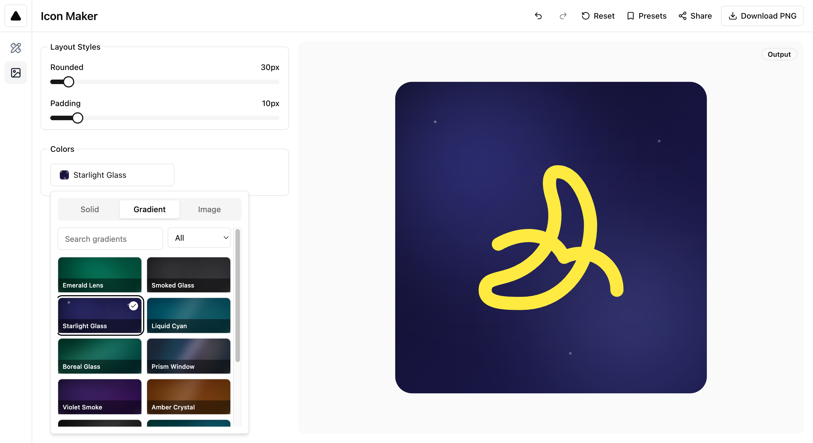

# Icon Maker

A focused browser editor for creating polished square icon assets. Choose an
icon, tune its appearance, pair it with a solid color, local image, or layered
gradient, and export a production-size PNG.



## Highlights

- Searchable, on-demand catalog with 1,767 icons
- 206 locally bundled layered gradients with no runtime network dependency
- Solid colors and bundled image backgrounds
- Live size, rotation, padding, and corner-radius controls
- Undo, redo, reset, and keyboard history shortcuts
- Local SVG icon import with strict sanitization and device-only storage
- PNG export at 512, 1024, and 2048 pixels, including transparent icon-only output
- Browser-local named presets and share links for built-in designs
- Versioned local persistence with validated settings
- Responsive controls and accessible keyboard interactions

## Stack

- React 19 and TypeScript
- Vite 8
- Tailwind CSS 4
- Radix UI primitives
- Lucide icons
- `html-to-image` for browser-native export
- pnpm

## Local development

Use Node.js 26.7.0 and pnpm 11.22.0.

```sh
pnpm install
pnpm dev
```

## Quality checks

Run all checks before you merge a change:

```sh
pnpm format:check
pnpm lint
pnpm test
pnpm test:e2e
pnpm build
```

## Production preview

```sh
pnpm build
pnpm preview
```

## Third-party notices

See [THIRD_PARTY_NOTICES.md](THIRD_PARTY_NOTICES.md) for bundled asset license
information.
